# Microsoft Sentinel SOC Analyst Investigation


## Overview

This project demonstrates a complete **Security Operations Center (SOC) analyst investigation** of a simulated Microsoft 365 account compromise.

The scenario begins with repeated failed sign-in attempts against a user account. The same source IP later successfully authenticates, the account shows an unusual geographic pattern, and suspicious PowerShell activity appears shortly afterward.

The project focuses on the work performed by a **SOC Analyst / Security Analyst / Cyber Defense Analyst**:

- Alert triage
- Authentication log analysis
- KQL threat hunting
- Identity investigation
- Endpoint correlation
- Incident timeline construction
- MITRE ATT&CK mapping
- Severity classification
- Containment recommendations
- Root-cause analysis
- Executive reporting

> **Important:** All identities, IP addresses, devices, timestamps, and events in this repository are simulated for portfolio and training purposes.

---

## Scenario

At approximately **02:14 UTC**, Microsoft Sentinel detects a burst of failed authentication attempts against:

`alex.johnson@contoso.com`

The activity originates from:

`185.220.101.42`

Several minutes later, the account successfully authenticates from the same source.

The analyst then identifies:

- An unfamiliar geographic location
- A recent U.S. sign-in that makes legitimate physical travel unlikely
- Encoded PowerShell activity on the user's workstation
- No known business justification for the suspicious source

The investigation is escalated as a suspected account compromise.

---

## Analyst Objectives

The investigation attempts to answer the following questions:

1. Is the alert a true positive or false positive?
2. Is the source IP known or approved?
3. Did the attacker successfully authenticate?
4. Was MFA involved?
5. Is the user's sign-in location abnormal?
6. Did the attacker target other users?
7. Was there suspicious activity after authentication?
8. Did the attacker gain endpoint execution?
9. What systems and identities are in scope?
10. What containment and remediation actions are appropriate?

---

## Investigation Workflow

```mermaid
flowchart LR
    A[Sentinel Alert] --> B[Initial Triage]
    B --> C[Review Sign-in Logs]
    C --> D[Correlate Failed and Successful Logins]
    D --> E[Check Geographic Anomalies]
    E --> F[Review Endpoint Activity]
    F --> G[Scope Environment]
    G --> H[Map MITRE ATT&CK]
    H --> I[Determine Severity and Disposition]
    I --> J[Contain and Remediate]
    J --> K[Document Incident]
```



---

## Environment

| Technology | Analyst Use |
|---|---|
| Microsoft Sentinel | SIEM triage, investigation, hunting |
| Microsoft Entra ID | Authentication and identity analysis |
| Microsoft Defender XDR | Endpoint and identity correlation |
| Kusto Query Language | Log analysis and threat hunting |
| MITRE ATT&CK | Adversary behavior mapping |
| CSV / Excel | Evidence and timeline review |
| GitHub | Portfolio documentation and version control |

---

## Repository Structure

```text
microsoft-sentinel-soc-analyst-project/
├── README.md
├── LICENSE
├── CONTRIBUTING.md
├── SECURITY.md
├── .gitignore
├── .github/
│   ├── PULL_REQUEST_TEMPLATE.md
│   └── ISSUE_TEMPLATE/
│       └── project-improvement.md
├── docs/
│   ├── executive-summary.md
│   ├── incident-report.md
│   ├── analyst-playbook.md
│   ├── evidence-log.md
│   ├── mitre-attack-mapping.md
│   ├── lab-setup.md
│   ├── interview-guide.md
│   └── screenshot-guide.md
├── kql/
│   ├── 01_failed_logons.kql
│   ├── 02_success_after_failures.kql
│   ├── 03_password_spray.kql
│   ├── 04_rare_country_signins.kql
│   ├── 05_impossible_travel.kql
│   ├── 06_suspicious_powershell.kql
│   ├── 07_post_compromise_activity.kql
│   └── 08_environment_scope.kql
├── detections/
│   └── failed-logons-followed-by-success.yaml
├── data/
│   ├── sample_signins.csv
│   ├── sample_device_process_events.csv
│   └── sample_incident_timeline.csv
└── screenshots/
    └── README.md
```

---

# Investigation

## 1. Initial Alert

**Alert:** Multiple failed sign-ins followed by successful authentication  
**User:** `alex.johnson@contoso.com`  
**Suspicious IP:** `185.220.101.42`  
**Initial Severity:** Medium  
**Final Severity:** High  
**Disposition:** True Positive

### Initial Analyst Questions

- Is the source IP normally used by the employee?
- How many failures occurred?
- Did a successful login follow?
- Did the same IP target other users?
- Was MFA challenged or satisfied?
- Was the device managed?
- Was the user traveling?
- Was a corporate VPN involved?
- Did suspicious activity occur after authentication?

---

## 2. Failed Sign-In Analysis

Query:

[`kql/01_failed_logons.kql`](kql/01_failed_logons.kql)

### Finding

The target account generated **27 failed authentication attempts** from the same source IP within approximately 10 minutes.

### Analyst Interpretation

The volume and timing exceed the pattern expected from normal user password mistakes.

Possible causes include:

- Targeted brute force
- Credential stuffing
- Automated credential guessing

---

## 3. Successful Authentication After Failures

Query:

[`kql/02_success_after_failures.kql`](kql/02_success_after_failures.kql)

### Finding

The same IP responsible for the failures later generated a successful authentication.

### Analyst Interpretation

This substantially increases the probability of a credential compromise.

A failed-login burst alone could be benign or unsuccessful malicious activity. A successful login from the same source materially changes the risk assessment.

---

## 4. Password Spray Review

Query:

[`kql/03_password_spray.kql`](kql/03_password_spray.kql)

### Purpose

Determine whether the source IP targeted multiple identities.

### Analyst Interpretation

If a single IP generates failures across many users, the pattern may be more consistent with **password spraying** than brute forcing one account.

---

## 5. Geographic Anomaly Review

Queries:

- [`kql/04_rare_country_signins.kql`](kql/04_rare_country_signins.kql)
- [`kql/05_impossible_travel.kql`](kql/05_impossible_travel.kql)

### Finding

The user authenticated from the United States shortly before authentication from Germany.

### Analyst Interpretation

The elapsed time is inconsistent with normal physical travel.

However, impossible-travel alerts must be validated against:

- Corporate VPNs
- Consumer VPNs
- Cloud proxies
- Mobile carrier routing
- Secure web gateways
- Known travel

This project assumes none of those explanations were identified.

---

## 6. Endpoint Investigation

Query:

[`kql/06_suspicious_powershell.kql`](kql/06_suspicious_powershell.kql)

### Finding

Encoded PowerShell activity appears shortly after the suspicious authentication.

### Analyst Interpretation

Encoded PowerShell is not automatically malicious.

In this case, the timing and surrounding identity compromise indicators increase the likelihood that it represents post-compromise execution.

---

## 7. Post-Compromise Review

Query:

[`kql/07_post_compromise_activity.kql`](kql/07_post_compromise_activity.kql)

The analyst searches for:

- Suspicious PowerShell
- Command shell execution
- Credential access indicators
- Remote tools
- Script interpreters
- New process activity
- Potential download behavior

---

## 8. Environment Scoping

Query:

[`kql/08_environment_scope.kql`](kql/08_environment_scope.kql)

### Analyst Goal

Determine whether the suspicious IP or account appears elsewhere in the environment.

Scoping should answer:

- Were other users targeted?
- Were other devices involved?
- Did the IP successfully authenticate elsewhere?
- Did similar PowerShell behavior occur on additional endpoints?
- Is the compromise isolated or widespread?

---

# Incident Timeline

| Time UTC | Event | Analyst Interpretation |
|---|---|---|
| 01:48 | Normal U.S. sign-in | Establishes recent legitimate activity |
| 02:14 | Failed sign-ins begin | Possible credential attack |
| 02:18 | Failure count increases | Automated behavior likely |
| 02:23 | Successful login from same IP | Potential account compromise |
| 02:27 | Unusual geographic location confirmed | Identity anomaly |
| 02:41 | Encoded PowerShell observed | Possible post-compromise execution |
| 02:46 | Incident escalated | High-confidence true positive |
| 02:52 | Sessions revoked | Identity containment |
| 02:55 | Password reset initiated | Credential remediation |
| 03:02 | Endpoint isolated | Endpoint containment |

The CSV version is available at:

[`data/sample_incident_timeline.csv`](data/sample_incident_timeline.csv)

---

# Findings

## Finding 1 — Repeated Failed Authentication

**Evidence:** 27 failed sign-in attempts from one unfamiliar source.

**Assessment:** Suspicious authentication behavior consistent with credential guessing.

---

## Finding 2 — Success From Same Source

**Evidence:** A successful login follows the failed attempts.

**Assessment:** Strong indicator that valid credentials may have been obtained.

---

## Finding 3 — Geographic Anomaly

**Evidence:** U.S. and German sign-ins occur within an unrealistic travel window.

**Assessment:** Possible credential, session, proxy, or token abuse.

---

## Finding 4 — Suspicious PowerShell

**Evidence:** Encoded PowerShell occurs shortly after the suspicious login.

**Assessment:** Possible execution after account compromise.

---

# Analyst Verdict

**Disposition:** True Positive  
**Final Severity:** High  
**Confidence:** High

### Rationale

The incident is escalated because several independent indicators align:

- High-volume authentication failures
- Successful authentication from the same source
- Unusual geographic behavior
- Temporal correlation with suspicious endpoint execution
- No known business justification

The combined identity and endpoint evidence is more consistent with account compromise than benign user activity.

---

# MITRE ATT&CK Mapping

| Technique | ID | Evidence |
|---|---|---|
| Brute Force | T1110 | Repeated authentication failures |
| Valid Accounts | T1078 | Successful login using valid credentials |
| PowerShell | T1059.001 | Encoded PowerShell execution |
| External Remote Services | T1133 | Suspicious external authentication |
| Account Discovery | T1087 | Recommended follow-on hunt; not confirmed |

Detailed mapping:

[`docs/mitre-attack-mapping.md`](docs/mitre-attack-mapping.md)

---

# Containment Recommendations

## Immediate

1. Revoke active sessions and refresh tokens.
2. Reset the affected user's password.
3. Require MFA re-registration if compromise is suspected.
4. Isolate the endpoint.
5. Block confirmed malicious infrastructure where appropriate.
6. Review mailbox forwarding rules.
7. Review OAuth consent grants.
8. Search the environment for matching indicators.

## Short-Term

- Harden Conditional Access.
- Disable legacy authentication.
- Enforce stronger MFA.
- Review risky sign-ins.
- Add approved VPN and corporate egress IPs to analyst watchlists.
- Tune detections for failures followed by successful authentication.

## Long-Term

- Adopt phishing-resistant MFA.
- Improve identity baselining.
- Automate high-confidence session revocation.
- Conduct recurring identity-compromise tabletop exercises.
- Review privileged account exposure.
- Add identity and endpoint correlation rules.

---

# Skills Demonstrated

- SOC alert triage
- Microsoft Sentinel
- Microsoft Entra ID
- Microsoft Defender XDR
- KQL
- SIEM analysis
- Identity threat detection
- Endpoint investigation
- Threat hunting
- Incident response
- MITRE ATT&CK
- Incident severity classification
- Root-cause analysis
- Technical documentation
- Executive reporting

---

# Interview Explanation

A concise way to explain this project:

> I built a simulated SOC investigation around a Microsoft 365 account compromise. I started with repeated authentication failures and correlated them with a successful login from the same source. I then analyzed geographic anomalies, reviewed endpoint telemetry, identified suspicious encoded PowerShell, scoped the environment for related activity, and mapped the behavior to MITRE ATT&CK. I classified the incident as a high-severity true positive and documented containment, remediation, and detection improvements.

See:

[`docs/interview-guide.md`](docs/interview-guide.md)

for a longer interview walkthrough.

---

# Screenshots

To make this portfolio stronger, replace the screenshot placeholders with screenshots from your own lab.

Recommended screenshots:

1. Sentinel incident page
2. Failed-login KQL results
3. Failed-login followed by success results
4. Geographic anomaly results
5. Suspicious PowerShell results
6. Defender endpoint timeline
7. Final incident timeline

See:

[`docs/screenshot-guide.md`](docs/screenshot-guide.md)

---

# Reproducing the Project

You can reproduce this investigation in:

- Microsoft Sentinel
- Log Analytics
- Microsoft Defender Advanced Hunting

See:

[`docs/lab-setup.md`](docs/lab-setup.md)

---

# Ethical Use

This repository is intended for defensive security education and portfolio demonstration.

Do not use the queries or techniques in this repository to access systems without authorization.

---

# License

This project is released under the MIT License.
